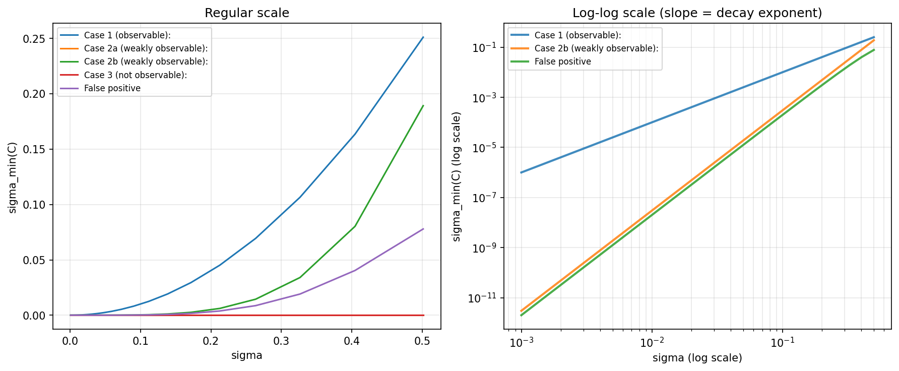

# Understanding and Expanding Observability Theory

Undergraduate research on nonlinear observability for Earth-centered satellite orbits, focused on
relative (liaison) configurations between two spacecraft. This repo covers three phases of the
project: a numerical observability pipeline for the satellite liaison problem, an investigation of
partial distance correlation as a nonlinear-aware alternative to classical rank-based observability
tests, and an exploratory side investigation into discrete-time (delay-embedding) analogues.

**Mentors:** Dr. Erin Beckman (Mathematics & Statistics) and Dr. Jackson Kulik (Mechanical &
Aerospace Engineering), Utah State University.

---

## Background

Modern space operations depend on knowing a satellite's position and motion — but real sensors
only give partial, noisy measurements. Observability theory asks a deceptively simple question:
given only an initial snapshot of a satellite's state, how much can we actually know about its
future? Linear observability theory answers this cleanly via rank conditions on an observability
matrix. Satellite dynamics, however, are nonlinear, and the nonlinear extension of these classical
results is still an open, underdeveloped area — which is what this project investigates.

---

## Phase 1 — Observability Pipeline (`observability_pipeline/`)

A full numerical simulation of the two-satellite liaison observability problem, comparing what
range-only versus angle-only measurements can (and can't) tell us about a satellite's state.

| File | Purpose |
|---|---|
| `orbits.py` | Generates realistic two-satellite orbits from real ISS orbital elements (Kepler's equation solved via Newton's method, propagated with `scipy.integrate.solve_ivp`). |
| `measurements.py` | Defines the range and line-of-sight angle measurement models and their Jacobians (verified against finite-difference approximations). |
| `stm.py` | Propagates the State Transition Matrix (STM) alongside the orbital dynamics and builds the observability Gramian. |
| `observability.py` | SVD-based rank/observability analysis of the Gramian, including a local-injectivity test via random perturbations. |
| `plots.py` | Generates all six figures below. |

Run in order — `plots.py` will pull in everything it needs from the other four files:

```bash
python plots.py
```

### Results

**Range-only measurements leave the system persistently rank-deficient.** Angle measurements do
better but are still rank-deficient when both satellites share nearly identical orbits, with
observable directions spanning several orders of magnitude in strength (i.e. technically observable,
but in some directions only very weakly so).

<p align="center">
  
  
</p>

<details>
<summary>All six figures</summary>

| | |
|---|---|
|  |  |
|  |  |
|  |  |

</details>

---

## Phase 2 — Partial Distance Correlation (`distance_correlation/`)

Classical observability tests are essentially linear correlation tests — they can miss genuinely
nonlinear dependencies, and worse, can report **false positives** (reporting full rank/observability
when the system is actually unobservable). This phase implements and tests partial distance
correlation as a nonlinear-aware alternative.

| File | Purpose |
|---|---|
| `crosscorr.py` | Defines four hand-derived cross-covariance cases (observable, two weakly-observable variants, and not-observable) plus a constructed false-positive case, and plots how their singular values behave. |
| `pdcorr.py` | Implements Pearson correlation, Pearson partial correlation, biased distance correlation, U-centered (unbiased) distance correlation, and partial distance correlation from scratch; sweeps uncertainty and measures the decay rate of the minimum singular value for each case. |
| `pdcorr2.py` | Additional targeted tests of the false-positive and weakly-observable cases using the functions from `pdcorr.py`. |
| `verify_theorem1_linear_case.py` | A symbolic (`sympy`) check that a cited paper's general nonlinear evolution theorem correctly reduces to the classical linear/Kalman covariance-propagation equations in the linear special case — a self-consistency check on literature this project builds on, not original theory. |

```bash
python pdcorr.py
```

### Results

Sweeping the minimum singular value against increasing uncertainty and measuring the log-log decay
rate:

| Case | Decay order (slope) |
|---|---|
| Observable | **2.0** (quadratic) |
| Weakly observable (Case 2b) | **4.0** (quartic) |
| False positive | **≈4.0** (quartic) |
| Weakly observable (Case 2a) / Not observable (Case 3) | identically zero — structurally unobservable, no defined slope |

The false-positive case decays at essentially the same rate as the genuinely weakly-observable case
— both quartic, both distinctly steeper than the fully-observable case's quadratic decay. This means
the decay exponent itself carries information a single-snapshot test cannot recover, and gives a
concrete, checkable way to distinguish a real weak-observability signal from a linear test's false
positive.

<p align="center">
  
</p>

---

## Phase 3 — Discrete-Time Exploration (`discrete_time_exploration/`)

An exploratory side investigation connecting this project's continuous-time nonlinear observability
framework to discrete-time analogues: the False Nearest Neighbors theorem, Takens' theorem, and
delay embeddings. The central idea explored: a differential embedding's Jacobian is exactly the
nonlinear observability matrix, and delay coordinates play a role analogous to additional
measurements.

> **Note:** `delay_embeddings_exploration.py` is exploratory code and depends on functions
> (`henon`, `delay_embedding`, `pdcor`) defined in `distance_correlation/pdcorr.py` — it isn't
> currently a standalone runnable script. It's included to document the direction of this
> investigation, which is ongoing.

---

## Setup

```bash
pip install -r requirements.txt
```

## Status & Next Steps

This project has not yet reached a publication or conference milestone, but has produced a working,
validated observability pipeline (Phase 1), a novel application of partial distance correlation to
this problem with a concrete decay-rate result distinguishing true weak observability from false
positives (Phase 2), and an open, promising connection to discrete-time/delay-embedding methods
(Phase 3) that's an active direction for future work.
